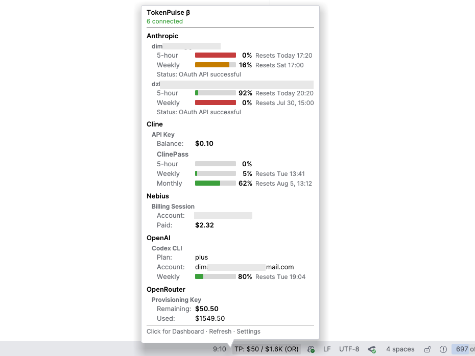

# TokenPulse

[](https://plugins.jetbrains.com/plugin/30615-tokenpulse)
[](https://github.com/DimazzzZ/tokenpulse-intellij-plugin/releases)
[](https://github.com/DimazzzZ/tokenpulse-intellij-plugin/actions/workflows/ci.yml)
[](LICENSE)

> ⚠️ **Beta Release** — This is an early release (v0.4.0). Features may change and some functionality may be incomplete. Please [report issues](https://github.com/DimazzzZ/tokenpulse-intellij-plugin/issues) on GitHub.

**TokenPulse** is an IntelliJ IDEA plugin that aggregates token balances and credit usage across multiple AI providers directly in your IDE status bar.

<p align="center">
  
</p>

## Why TokenPulse

Juggling several AI providers means several dashboards, several logins, and no single answer to
"how much have I got left?". TokenPulse pulls all of it into one place — your IDE status bar — and
keeps it fresh in the background so you never have to go looking.

## Highlights

- **📊 One-glance aggregate balance** — combined remaining credits/tokens live in the status bar,
  with flexible display modes (auto, total dollars, or a single provider).
- **🤖 Seven providers, one view** — Claude Code, Codex/ChatGPT, OpenAI Platform, Cline, OpenRouter,
  Nebius AI Studio, and Xiaomi MiMo (see the [table](#provider-authentication) below).
- **🔄 Sessions that refresh themselves** — Nebius and Xiaomi silently re-mint their session in the
  background when it rotates, so a still-valid login keeps working without reconnecting.
- **🔑 OAuth tokens kept in sync** — for Claude Code and Codex/ChatGPT, TokenPulse reads the login
  the CLI already stored, refreshes expired tokens automatically, and **writes the rotated tokens
  back** so your real CLI login stays valid too.
- **👥 Claude multi-account** — auto-discovers every logged-in Claude account (default `~/.claude`
  plus any `CLAUDE_CONFIG_DIR` logins), one row each, labelled by identity (`email • organization`).
- **🛈 Rich hover tooltip** — a native Swing popup with real per-account progress bars, theme-aware
  colors, and humanized reset times (`Today 14:30`, `Wed 09:00`, …).
- **📉 Balance history chart** — trends over 24h / 7d / 30d / all time.
- **🔐 Secure storage** — credentials live in IntelliJ's `PasswordSafe` (OS keychain), never in
  plain-text settings.
- **⚙️ Smart refresh** — configurable auto-refresh with TTL caching and single-flight coalescing
  to stay under rate limits.

## Installation

### From Marketplace
1. Open IntelliJ IDEA → `Settings` → `Plugins`
2. Search for "TokenPulse" in Marketplace
3. Click `Install`

### From GitHub Releases
1. Download the latest `token-pulse-*.zip` from [Releases](https://github.com/DimazzzZ/tokenpulse-intellij-plugin/releases)
2. Open IntelliJ IDEA → `Settings` → `Plugins`
3. Click the ⚙️ icon → `Install Plugin from Disk...`
4. Select the downloaded ZIP file

## Setup

1. Open **Settings** → **Tools** → **TokenPulse**.
2. Click **+** to add a provider account:
   - Select the **Provider** (Claude Code, Codex/ChatGPT, OpenAI Platform, Cline, OpenRouter,
     Nebius AI Studio, or Xiaomi MiMo).
   - Follow the provider-specific instructions in the dialog.
3. Configure the **Refresh Interval** (default: 15 minutes).
4. The aggregate balance appears in your status bar automatically.

### Provider Authentication

| Provider | Auth Type | How to Connect |
|---|---|---|
| Claude Code | **CLI + OAuth** | Requires `claude` CLI installed + logged in; auto-discovers all logged-in accounts |
| Codex / ChatGPT | **CLI + OAuth** | Requires `codex` CLI installed and authenticated (`codex login`) |
| OpenAI Platform | **Admin API Key** (`sk-admin-...`) | https://platform.openai.com/settings/organization/admin-keys |
| Cline | API Key | https://app.cline.bot/dashboard/account?tab=api-keys |
| OpenRouter | **Provisioning Key** | https://openrouter.ai/settings/provisioning-keys |
| Nebius AI Studio | **Billing Session** (cURL capture) | Click "Connect Billing Session →" and copy a `getBalance` request as cURL (see [FAQ](#how-does-nebius-authentication-work)) |
| Xiaomi MiMo | **Session** (cURL capture or in-IDE sign-in) | Click "Connect Xiaomi Account →" and capture the session |

> **Tip:** If you add multiple accounts for the same provider, each entry shows a partial key preview
> (e.g. `sk-or-…91bc`) so you can tell them apart at a glance.
> Claude Code rows show the account's config directory instead (`~/.claude` for the default
> login, `~/.claude-work` for a `CLAUDE_CONFIG_DIR` account, etc.).

> **Xiaomi MiMo (0.4.0):** the two former connection types — "API (Pay-as-you-go)" and
> "Token Plan" — are now a single **Xiaomi MiMo** account that tracks both the pay-as-you-go
> dollar balance and Token Plan Credits from one captured session. Existing accounts migrate
> automatically on upgrade.

## Status Bar Display

TokenPulse offers flexible status bar display options:

- **Auto Mode** — Adapts based on your first provider (shows % for Claude/ChatGPT, $ for others)
- **Total Dollars** — Shows combined balance across all dollar-based providers
- **Single Provider** — Shows data from a specific selected provider

Configure display preferences in **Settings** → **Tools** → **TokenPulse**.

## FAQ

### Why does TokenPulse require a manually generated key for some providers?

TokenPulse reads your **credit/balance** from each provider's API. OAuth-issued tokens do not
have access to the balance/credits endpoints on Cline or OpenRouter — only manually
generated keys do. This is a provider-side limitation, not a plugin choice.

### How does Nebius authentication work?

Nebius AI Studio does **not** expose a billing API accessible via API key. TokenPulse reads your
trial balance from the same internal billing gateway used by the Token Factory web UI.

The **"Connect Billing Session →"** dialog walks you through capturing the request your browser
already makes:
1. Open Nebius, log in, then open DevTools → **Network**.
2. Refresh the page, filter for `getBalance`, right-click the request → **Copy as cURL**.
3. Paste the cURL command into the dialog and click **Validate**.

Once connected, TokenPulse silently refreshes the CSRF token when it rotates (the common
auth failure) by re-fetching the SPA landing page, so a still-valid session keeps working
without reconnecting.

### Why does OpenRouter require a Provisioning Key specifically?

OpenRouter's regular API keys do **not** expose the `/api/v1/credits` endpoint. Only
**Provisioning Keys** return credit balance information.

You can create a Provisioning Key at: https://openrouter.ai/settings/provisioning-keys

### How does OpenAI usage tracking work?

OpenAI's **Organization Usage API** and **Organization Costs API** provide access to organization-wide
usage and cost data. TokenPulse fetches:

- **Credits used** — Total cost from the `/v1/organization/costs` endpoint
- **Tokens used** — Sum of input, output, cached input, and reasoning tokens from the `/v1/organization/usage/completions` endpoint

> **Admin API Key required:** Only Admin API Keys (`sk-admin-...`) have access to the Organization
> APIs. Regular project/personal keys will be rejected. Admin keys are created at:
> https://platform.openai.com/settings/organization/admin-keys

### How does ChatGPT subscription tracking work?

ChatGPT Pro/Plus/Team users sign in once with the `codex` CLI (`codex login`). TokenPulse then
reads the OAuth credentials that `codex` already stored for you in `~/.codex/auth.json` (or
`$CODEX_HOME/auth.json`) and calls ChatGPT's usage API directly to display 5-hour, weekly, and
code-review rate-limit quotas. It no longer spawns a `codex app-server` subprocess.

When the stored access token expires, the plugin refreshes it using the refresh token and writes
the rotated tokens back to `auth.json` so your real `codex` login stays in sync — you should not
have to re-login on the CLI just because your IDE was closed for a while. If the refresh token has
been revoked, TokenPulse asks you to run `codex` to sign in again.

### How does Claude Code tracking work?

TokenPulse reads the OAuth credentials that the `claude` CLI already stored for you (macOS
Keychain, or `~/.claude/.credentials.json` on Linux/Windows) and calls Claude's usage API
directly to fetch 5-hour and weekly utilization percentages. It no longer parses `claude` CLI
output. When the stored token expires, the plugin refreshes it automatically using the refresh
token — you should not have to re-login on the CLI just because your IDE was closed for a while.

If you have multiple Claude accounts on the same machine (via `CLAUDE_CONFIG_DIR`), TokenPulse
auto-discovers every one it finds — the default `~/.claude` login plus any custom
config-dir logins — and shows one row per account, each with its own utilization.

Setup remains the same as before: install and log in via the Claude CLI, then add the
provider in TokenPulse — the plugin picks up your credentials automatically.
```bash
npm install -g @anthropic-ai/claude-code
claude login
```

### Is my key stored securely?

Yes. Keys are stored in IntelliJ's `PasswordSafe` (OS keychain on macOS/Windows, encrypted file
on Linux). They are never written to plain-text settings files.

### The status bar shows "—" or "Error"

- **Auth Error** — for API-key providers (Cline, OpenRouter, OpenAI Platform) the key is invalid or revoked; re-generate it from the provider's dashboard and re-enter it in TokenPulse. For CLI/OAuth/session providers (Claude Code, Codex/ChatGPT, Nebius, Xiaomi MiMo) the login or captured session expired; re-run the CLI login (e.g. `claude login`) or reconnect the session — the notification tells you which action applies.
- **Rate Limited** — too many requests. Increase the refresh interval in Settings → TokenPulse.
- **Error** — a network or API error. Check your internet connection and try "Refresh All" from the dashboard.
- **$X.XX used** — OpenAI account showing usage data (not a balance).

## Compatibility

- **IntelliJ Platform** — 2024.2+ (build 242+); no upper bound (compatible with current and future builds)
- **Java** — 21 (LTS)
- **IDEs** — IntelliJ IDEA (Community & Ultimate), WebStorm, PyCharm, and other JetBrains IDEs

## Development

See [DEVELOPMENT.md](DEVELOPMENT.md) for detailed instructions on building and testing the plugin.

## License

This project is licensed under the MIT License — see the [LICENSE](LICENSE) file for details.
